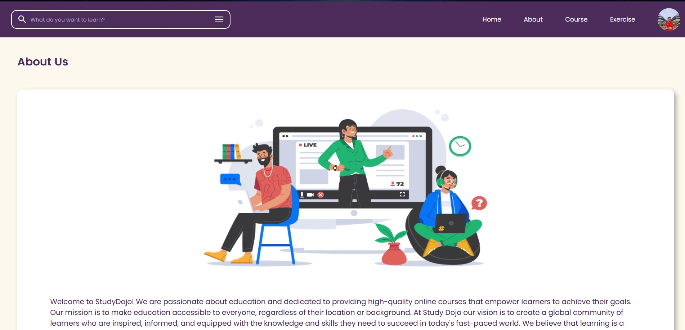

<a name="readme-top"></a>
<br />
<div align="center">
  <a href="https://github.com/Mehmed13/tugas-besar-1">
  </a>

  <h3 align="center">StudyDojo</h3>

  <p align="center">
    Platform Online Course untuk Siswa SMA<br>
</div>


<!-- TABLE OF CONTENTS -->
<details>
  <summary>Table of Contents</summary>
  <ol>
    <li>
      <a href="#about-the-project">About The Project</a>
      <ul>
        <li><a href="#built-with">Built With</a></li>
      </ul>
    </li>
    <li>
      <a href="#getting-started">Getting Started</a>
      <ul>
        <li><a href="#dependencies">Dependencies</a></li>
        <li><a href="#prerequisites">Prerequisites</a></li>
        <li><a href="#installation">Installation</a></li>
      </ul>
    </li>
    <li><a href="#changes">Changes</a></li>
    <li><a href="#usage">Usage</a></li>
    <li><a href="#contributions">Contributions</a></li>
    <li><a href="#contact">Contact</a></li>
  </ol>
</details>


<!-- ABOUT THE PROJECT -->
## About The Project

Studydojo 

<p align="right">(<a href="#readme-top">back to top</a>)</p>


### Built With

* HTML
* CSS
* Javascript
* PHP

<p align="right">(<a href="#readme-top">back to top</a>)</p>


<!-- GETTING STARTED -->
## Getting Started

Tanpa Berlama-lama inilah cara menjalankan web app
### Prerequisites

* Docker
    ```sh
    https://www.docker.com/
    ```
* Git
    ```sh
    https://git-scm.com/downloads
    ```

### Installation


1. Clone Repo ini dengan menggunakan cmd pada directory yang diinginkan
    ```sh
    C:\Users\MerekLaptop> 
    git clone https://github.com/Mehmed13/tugas-besar-1
    ```
2. Buka Directory tempat file di clone
   ```sh
   C:\Users\MerekLaptop> cd tugas-besar-1
   C:\Users\MerekLaptop\tugas-besar-11>
   ```
3. Jalankan docker 
   ```sh
   C:\Users\MerekLaptop\tugas-besar-1>
   docker-compose up -d
   ```
4. buka http://localhost:8080 di browser favorit kalian
5. StudyDojo siap untuk dipakai

<!-- USAGE EXAMPLES -->
## Usage

1. Home


2. Course Admin


4. Module Admin


5. Material Admin


6. Exercise Admin


7. Study History


8. Course


9. Module


10. Material


11. Exercises


12. Exercise 


13. Profile


14. About Us



<!-- CONTRIBUTING -->
## Contributions
* Client-side (html,css,js)

|feature|13521051|13521066|13521106|
|-------|--------|--------|--------|
|register||:heavy_check_mark:|:heavy_check_mark:|
|login||:heavy_check_mark:|:heavy_check_mark:|
|home|||:heavy_check_mark:|
|course|:heavy_check_mark:||:heavy_check_mark:|
|course_admin|:heavy_check_mark:|:heavy_check_mark:|||
|exercise|:heavy_check_mark:|:heavy_check_mark:||
|exercise_admin|:heavy_check_mark:|:heavy_check_mark:|:heavy_check_mark:|
|courses|:heavy_check_mark:|:heavy_check_mark:|:heavy_check_mark:|
|exercises|:heavy_check_mark:|:heavy_check_mark:|:heavy_check_mark:|
|material|:heavy_check_mark:|:heavy_check_mark:|:heavy_check_mark:|
|material_view|:heavy_check_mark:|:heavy_check_mark:|:heavy_check_mark:|
|material_admin|:heavy_check_mark:|:heavy_check_mark:|:heavy_check_mark:|

* Server-side(php)

|feature|13521051|13521066|13521106|
|-------|--------|--------|--------|
|Docker||:heavy_check_mark:|:heavy_check_mark:|
|Routing|||:heavy_check_mark:|
|DB|:heavy_check_mark:|:heavy_check_mark:|:heavy_check_mark:|

* both

|feature|13521051|13521066|13521106|
|-------|--------|--------|--------|
|AJAX|:heavy_check_mark:|:heavy_check_mark:|:heavy_check_mark:|

<p align="right">(<a href="#readme-top">back to top</a>)</p>


<!-- CONTACT -->
## Contact
|Name|Contact|Github|
|----|-------|------|
|Manuella Ivana Uli Sianipar | 13521051@std.stei.itb.ac.id| <a href="https://www.github.com/manuellaiv">@manuellaiv</a>|
|Muhammad Fadhil Amri | 13521066@std.stei.itb.ac.id |<a href="https://www.github.com/Mehmed13">@Mehmed13</a>|
|Mohammad Farhan Fahrezy | 13521106@std.stei.itb.ac.id|<a href="https://www.github.com/farhanfahreezy">@farhanfahreezy</a>|

<p align="right">(<a href="#readme-top">back to top</a>)</p>
